# Document Request System

## 1. Project Overview
The **Document Request System** is a full-stack web-based application designed to make the proccessing of academic documents automated and centralized, instead of using traditional and manual system. it includes academic paper such as:
- Certificate of Enrollment
- Transcript of Records
- Good Moral Certificate
It allows students to request online, while admin can manage, update of status and upload released documents in real-time.

### 📂 Repository Structure
```text
DocumentRequestSystem/
├── client-side/                          # Angular 17+ Frontend
│   ├── .angular/                         # Angular build cache
│   ├── .vscode/
│   │   ├── extensions.json
│   │   ├── launch.json
│   │   ├── mcp.json
│   │   └── tasks.json
│   ├── dist/                             # Production build output
│   ├── node_modules/
│   ├── public/
│   │   └── favicon.ico
│   ├── src/
│   │   ├── app/
│   │   │   ├── components/
│   │   │   │   ├── admin/
│   │   │   │   │   ├── dashboard/
│   │   │   │   │   └── manage-request/
│   │   │   │   ├── auth/
│   │   │   │   │   ├── login/
│   │   │   │   │   └── register/
│   │   │   │   └── user/
│   │   │   │       ├── dashboard/
│   │   │   │       ├── my-request/
│   │   │   │       ├── new-request/
│   │   │   │       └── profile/
│   │   │   ├── guards/
│   │   │   ├── interceptors/
│   │   │   ├── services/
│   │   │   ├── app.ts
│   │   │   ├── app.routes.ts
│   │   │   └── app.config.ts
│   │   ├── environments/
│   │   ├── index.html
│   │   ├── main.ts
│   │   └── styles.css
│   ├── package.json
│   └── tsconfig.json
│
├── server-side/                          # Express.js Backend
│   ├── node_modules/
│   ├── src/
│   │   ├── config/
│   │   ├── controllers/
│   │   ├── middleware/
│   │   ├── models/
│   │   ├── routes/
│   │   └── server.ts
│   ├── package.json
│   └── tsconfig.json
│
├── screenshots/                          # Documentation/Testing
│   ├── API-Testing/
│   └── UI/
│
├── .env.example
├── .gitignore                            # Excluded files (node_modules, etc.)
└── README.md                             # Project Documentation
```

---

##  2. Live Links

Frontend URL: https://itas-final-project.vercel.app

Backend API URL: https://itas-final-project.onrender.com

---

## 3. Tech Stack

Frontend: Angular 17+, Tailwind CSS, TypeScript

Backend: Node.js + Express.js + TypeScript

Database & Storage: 
Firestore: Real-time database for document requests.
Supabase Storage: Secure storage para sa uploaded files.
Firebase Authentication: User at Admin identity management.

---

## 4. Setup Instructions

| Prerequisites | Description / Command |
| :--- | :--- |
| **Node.js** | `>= 18` |
| **Angular CLI** | `npm install -g @angular/cli` |
| **Firebase Account** | For Database and Authentication |
| **Supabase Account** | For Storage |

---

## 1. Clone the Repository

```Bash
git clone https://github.com/roces123/DocumentRequestSystem.git
cd DocumentRequestSystem
```
---

## 2. Backend Setup

```Bash
cd server-side
npm install
cp .env.example .env

# Edit .env and fill in: JWT_SECRET, SUPABASE_URL, SUPABASE_KEY, etc.
npm run dev
# Server runs at http://localhost:3000
# Swagger docs at http://localhost:3000/api-docs
```
---

## 3. Frontend Setup
```Bash
cd client-side
npm install
ng serve
# App runs at http://localhost:4200
```
---

## 5. API Overview
Method | Endpoints | Description |
| :--- | :---: | ---: |
POST | /api/auth/login | User/Admin authentication |
GET | /api/requests | Get all document requests |
POST | /api/requests | Submit new request |
PATCH | /api/requests/:id | Update status in adminRemarks |
DELETE | /api/requests/:id | Delete Request |

---

## 6. Features Implemented

### 👤 Student / User Features
- [x] Register & Login with JWT Authentication
- [x] Create Document Requests with Purpose and Category
- [x] Upload Supporting Attachments (ID/Requirements)
- [x] Real-time Request Status Tracking (Pending, Processing, Released)
- [x] View Personal Request History with Detailed Info
- [x] Profile Integration (Auto-fetch Name, Email, and Student Info)
- [x] Secure File Management via Supabase Storage

---

### 🔑 Admin Features
- [x] Admin Dashboard with Real-time Request Stats
- [x] View and Manage ALL Student Requests
- [x] Update Request Status (Pending, Processing, Released)
- [x] Manage and View Student Attachments
- [x] User and Role Management (View/Search Users)
- [x] Audit Trail for Request Processing and Timestamps

---

### ⚙️ Technical Features
- [x] **Angular 18** Standalone Components Architecture
- [x] **Node.js + Express** REST API on Render
- [x] **JWT Auth Interceptor** (Auto-injects token)
- [x] **Dual-Database Sync**: Firestore (Metadata) + Supabase (Files)
- [x] **File Uploads** via Multer + Supabase Storage
- [x] **Role-Based Access Control (RBAC)**
- [x] **Tailwind CSS** Responsive UI Design
- [x] **Swagger/OpenAPI** API Documentation
- [x] **CORS and Security** Middleware Implementation

---


## 7. Screenshots

### UI Screenshots

| Page | Description | Preview |
| :--- | :--- | :--- |
| Signin Page | Signin page for users and admin | 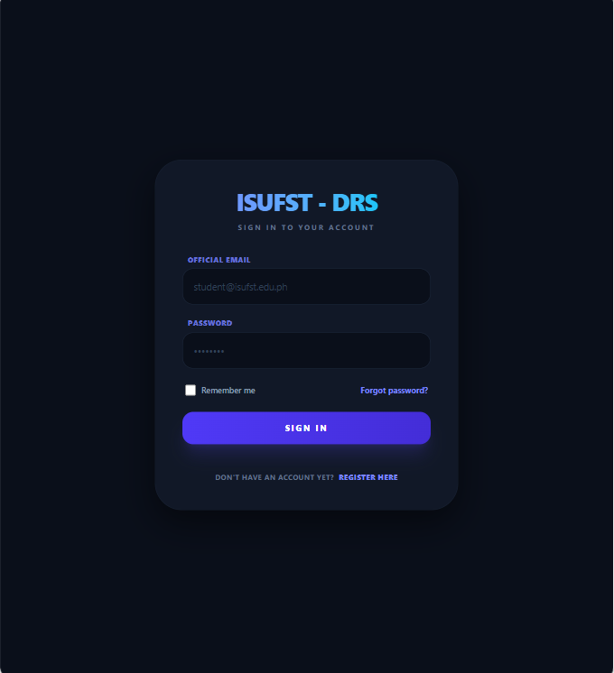 |
| Register | Page where users can register or create account | 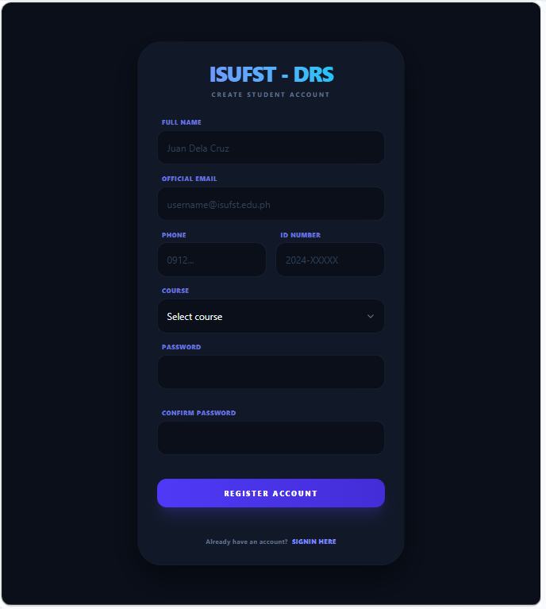 |
| Admin Dashboard | Admin dashboard showing analytics | 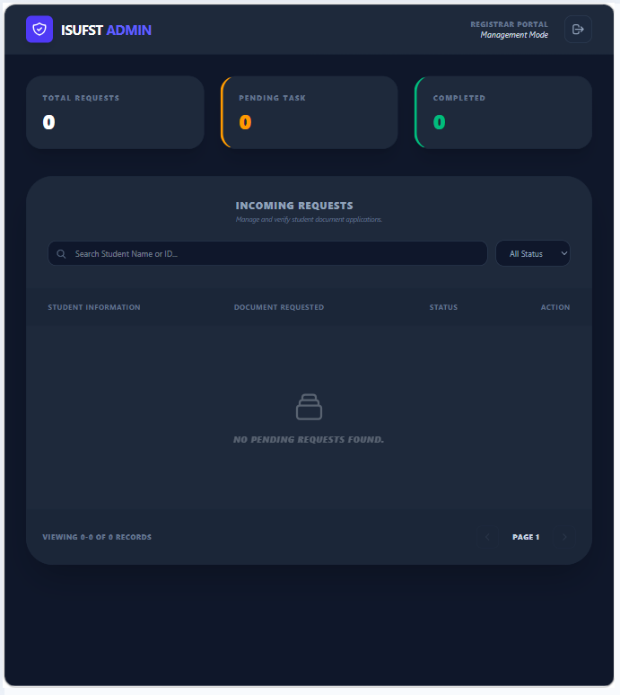 |
| User Dashboard | User dashboard showing request history | 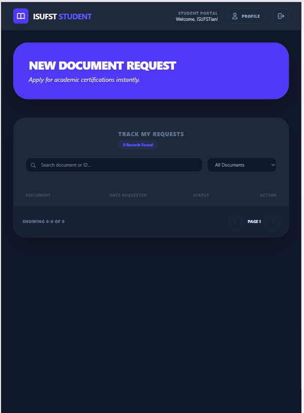 |
| Manage Request | Admin tools to manage every request | 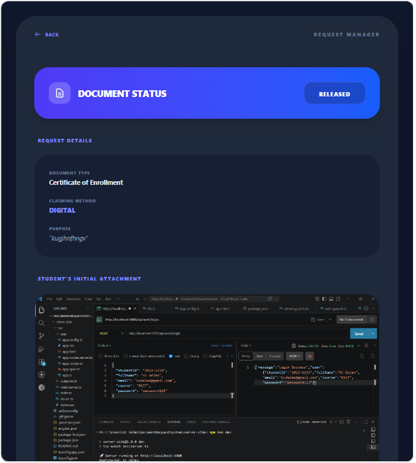 <br> 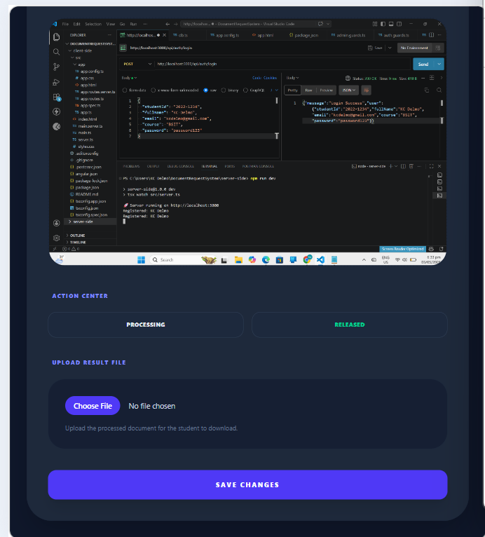 |
| New Request | Form to add new request | 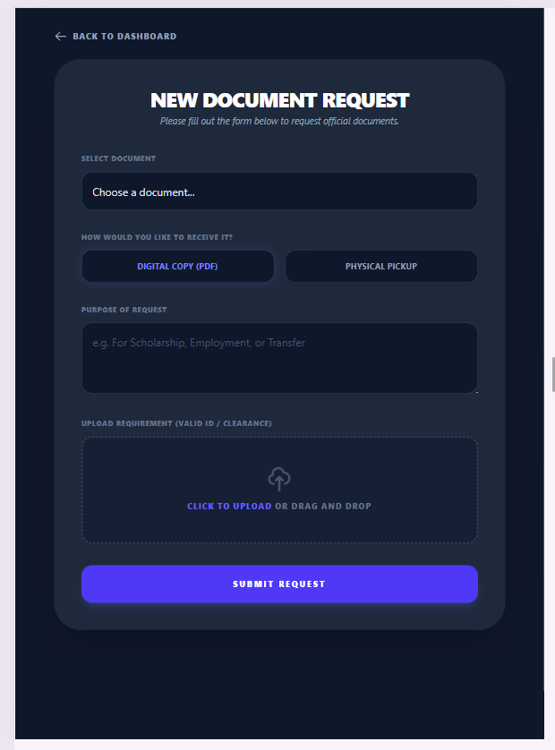 |
| My Request | Student view of request progress | 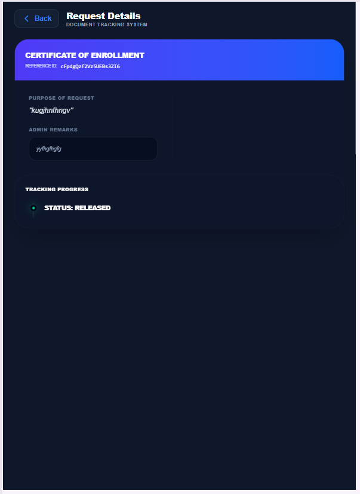 |

### API Testing Screenshots

| Page | Description | Preview |
| :--- | :--- | :--- |
| Admin Login | API login testing for admin | 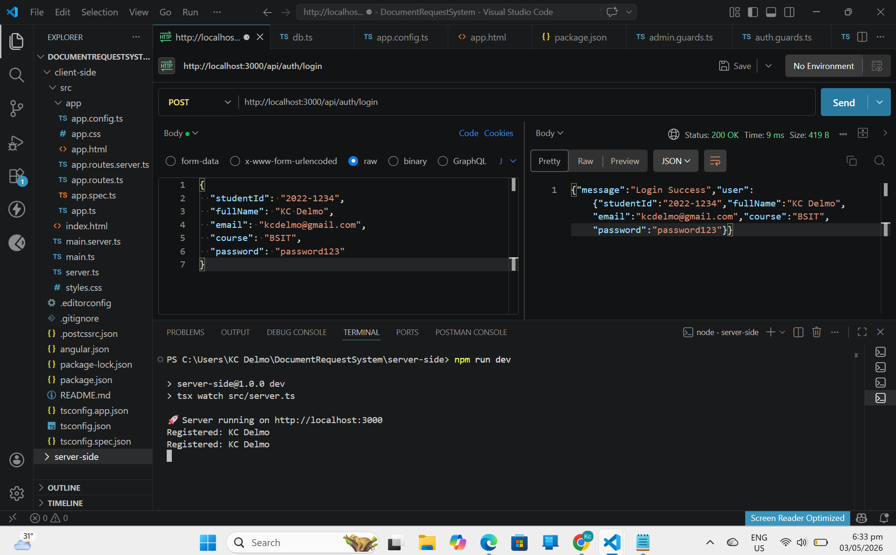 |
| User Login | API login testing for user | 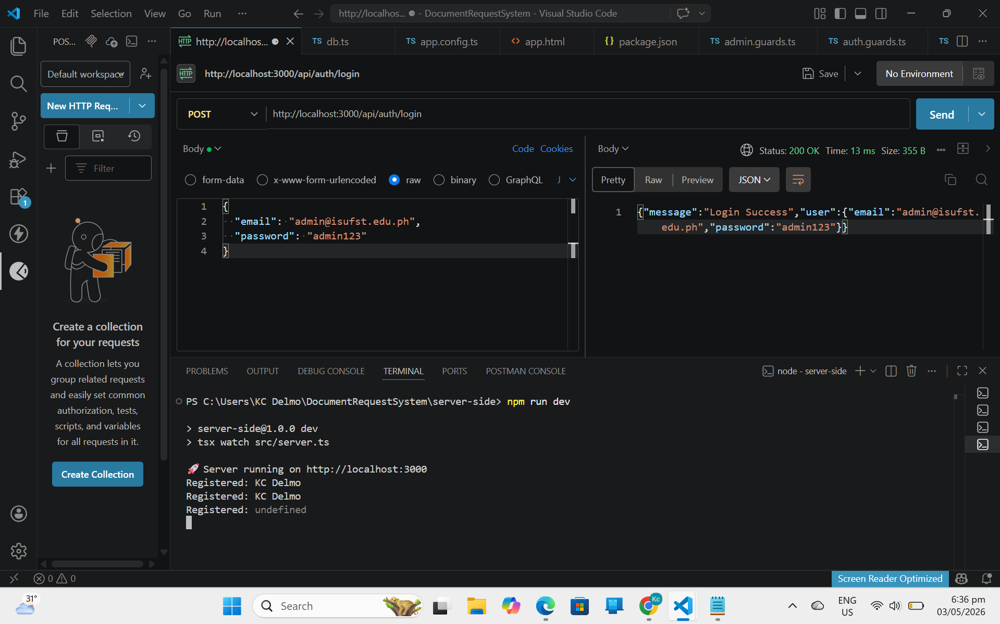 |
| Register Testing | API register testing | 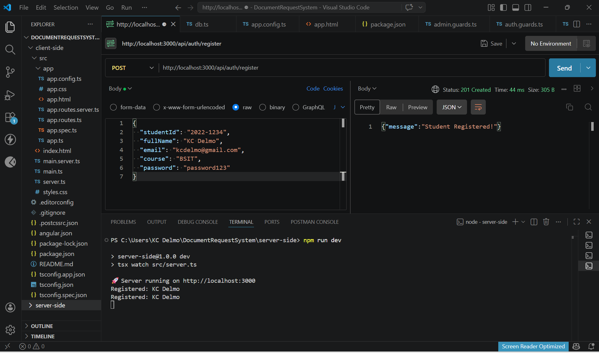 |

---

## 8. Security Notes

The following are never included in GitHub Repository for security:

serviceAccountKey.json

.env files

node_modules/

Sensitive credentials should NEVER be pushed to GitHub.
